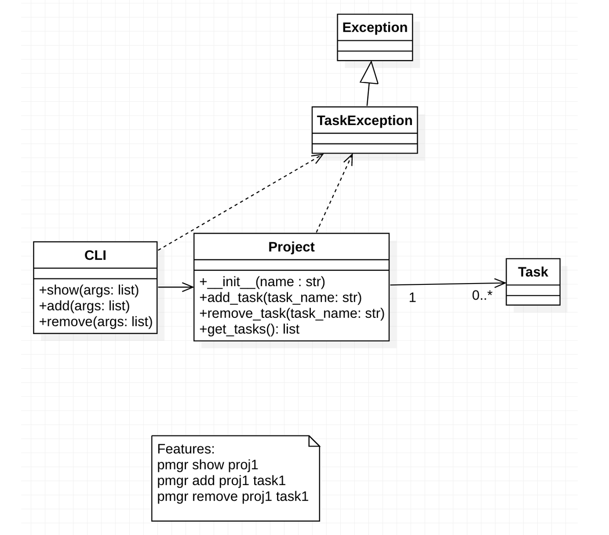

# softeng23-a3

## Setting Up the Cloned Project

After cloning this repository, set up the development environment and run tests using the following.

```console
python3 -m venv env
source env/bin/activate
pip install -r requirements.txt 
make build
make test
```

You will never need to repeat all the above commands.  If you come back in a different shell, you will need to only do these:

```console
source env/bin/activate
make test
```

## The Actual Assignment



1. In our UML diagram, should Task be a class or should it simply be a string?  Why or why not?
<br />   We think it should be a class because adding and removing things will be easier that way. Plus it will be easier to copy if there is multiple variables to that task.
2. What future enhancements might you add to this project next?  Does the answer to this question change your answer to the first question?
   <br /> Some future enhancements could potentially be, users being assigned to certain tasks or whether or not the task is completed or not. This would not change our answer to the first question, as this could simply be new variables added to the class itself.
